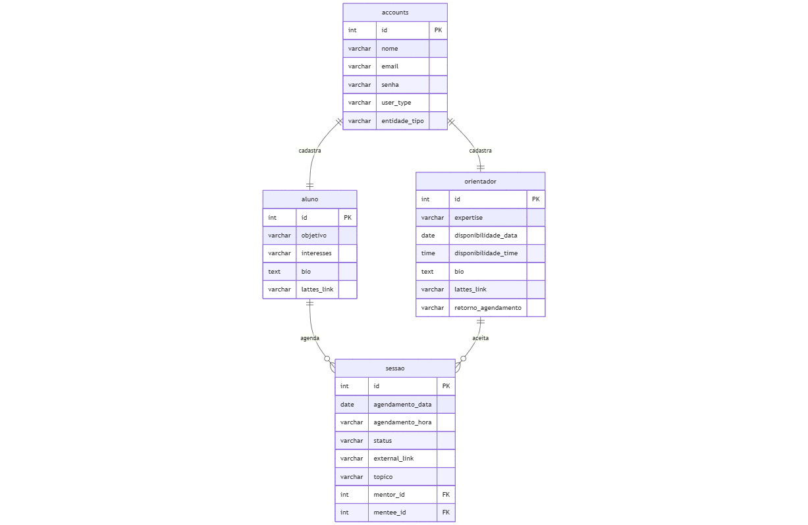

# Web Application Document - Projeto Individual - Módulo 2 - Inteli

## OrientaJovem

#### Nathália Pires de Figueredo

## Sumário

1. [Introdução](#c1)  
2. [Projeto Técnico da Aplicação Web](#c3)  
4. [Desenvolvimento da Aplicação Web](#c4)  
5. [Referências](#c5)  

 

## 1. Introdução 

O sistema de orientação nasce como uma resposta concreta a um dos maiores desafios enfrentados pela PSEducation, organização sem fins lucrativos que fundei com o propósito de democratizar o acesso à ciência e à tecnologia para jovens brasileiros, especialmente aqueles de regiões sem acesso a oportunidades ou com pouca representatividade nos espaços acadêmicos. 

O sistema de mentorias surge como resposta ao desafio central da organização: garantir que estudantes da organização tenham acesso a orientação qualificada para desenvolverem suas próprias pesquisas. Para isso, criamos uma plataforma que conecta orientadores — jovens cientistas, especialistas ou profissionais com experiência em pesquisa — a estudantes que desejam transformar ideias em artigos. Com recursos como criação de perfis, classificação por tópicos de interesse e agendamento de sessões, o sistema oferece um programa estruturado de orientação científica, acessível, organizado e colaborativo. Mais do que uma ferramenta, representa um passo essencial para tornar a ciência um espaço de pertencimento e realização para todos.

## 2. Projeto da Aplicação Web

### 2.1. Modelagem do banco de dados 

Ao projetar um banco de dados eficiente e funcional, é essencial compreender os modelos lógico e físico de banco de dados. O modelo lógico descreve como os dados são organizados e relacionados entre si, utilizando estruturas como tabelas, chaves e relacionamentos. Já o modelo físico representa como esses dados são efetivamente salvos no sistema de armazenamento, considerando aspectos como desempenho, índices e alocação de espaço. Nesta sessão, vamos explor o processo para a criação desses modelos.

#### Entidades relacionadas: 
- Accounts;
- Aluno;
- Orientador;
- Sessão 

#### Funcionalidades do Sistema:

_Cadastro e Login:_ Usuário pode se registrar como mentor ou mentorado (email e senha)

_Perfil do Usuário:_
- Orientadores: área de expertise, disponibilidade, biografia, link do lattes
- Alunos: objetivos, áreas de interesse, breve apresentação

_Agendamento de Sessões:_
- Mentorado escolhe um mentor e agenda datas/horários
- Mentor pode aceitar ou recusar
- Sessões agendadas ficam listadas no painel

#### Relações entre as entidades:
- Um account pode ser cadastrado como aluno(1:1);
- Um account pode ser cadastrado como orientador(1:1);
- Város alunos podem agendar várias sessões (N:N);
    - Um aluno pode agendar várias sessões (1:N);
    - Um orientador aceitar ter várias sessões (1:N).

#### Modelo Lógico:
Dessa forma, estruturamos uma tabela  accounts com atributos essenciais de cadastros, incluindo um atributo direcionada a escolha do tipo de usuário: orientador ou aluno. A partir desse campo, o sistema se conecta com duas tabelas específicas, de orientador e aluno, cada uma com seus atributos. Essas se relacionam pela tabela de associação "Sessão", que representa a interação entre orientador e aluno. Ilustrado na imagem abaixo:

#### Modelo Físico:
Para o modelo físico foi traduzida a linguagem desenvolvida no Mermaid para o modelo lógico para SQL, o qual adicionamos no arquivo SQL da pasta migrations.
[Aqui está o código SQL que cria a estrutura de um banco de dados.](migrations/202505091120_init.sql)

### 2.2. Models
Nesta seção, são descritos os models (esquemas de validação) utilizados no sistema web, desenvolvidos com a biblioteca Joi para garantir a integridade e consistência dos dados recebidos pela aplicação.Cada model representa uma entidade do sistema, como usuários, alunos, orientadores e sessões,  e define as regras de validação para os  dados, como tipos, obrigatoriedade e formatos esperados.

#### Accounts
Esse modelo representa os dados básicos de um usuário do sistema, independentemente de ele ser um aluno ou orientador. 

_Campos:_ (todos obrigatórios)
- nome (string): Nome do usuário com no mínimo 3 e máximo de 50 caracteres. 
- email (string): E-mail válido do usuário. 
- senha (string) :   Senha de no mínimo 6 caracteres. 
- user_type (string): Tipo de usuário, se é um orintador ou aluno. 

#### Aluno
Model que representa um perfil de aluno, vinculado a uma conta base (id_account).

_Campos:_ (todos obrigatórios)
- objetivo(string): objetivo do aluno com a plataforma.
- interesses(string): interesses acadêmicos ou científicos.
- bio(string): biografia do aluno
- lattes_link(string): link para o currículo lattes . Deve ser uma URL válida.
- id_account(string): identificador da conta associada.

Representao perfil completo de um estudante buscando orientação.

#### Orientador
Model que representa um perfil de orientador disponível para sesões.

_Campos:_ 
- expertise (string): objetivo do aluno com a plataforma. Obrigatório!
- disponibilidade_data(string): interesses acadêmicos ou científicos. Obrigatório!
- disponibilidade_time (string): biografia do aluno. Obrigatório!
- bio (string): biografia do orientador. Opcional!
- retorno_agendamento(boolean): se a orientador retirnará ou não sobre agendamento. Obrigatório!
- lattes_link(string): link para o currículo lattes . Deve ser uma URL válida. Opcional!
- id_account(string): identificador da conta associada. Obrigatório!

Representao perfil completo de um orientador oferecendo orientação.

#### Sessão
Model que representa uma sessão de orientação entre aluno e um orientador.

_Campos:_ 
- agendamento_data(string): Data da Sessão. Obrigatório!
- agendamento_hora(string): Hora da Sessão. Obrigatório!
- Status (string): Status da sessão, se está agendada, cancelada ou realizada. Obrigatório!
- external_link(string): Link para a sessaõ com uma URL. Opcional!
- topico(string): Tópico a ser tratado na sessão. Obrigatório!
- id_orientador (string UUID): ID do orientador. Obrigatório!
- id_aluno (string UUID): ID do aluno.Obrigatório!

Essa registra e controla os encontros entre alunos e orientadores.

### 2.3. WebAPI e endpoints 
Esta seção expõe quatro conjuntos de endpoints REST em /api/accounts, /api/aluno, /api/orientador e /api/sessao. Todos aceitam e devolvem JSON. As APIs foram projetadas para permitir a integração e o uso eficiente do sistema por meio de requisições padronizadas, facilitando operações como criação de contas, cadastro de alunos e orientadores, agendamento de sessões e consulta de dados.

Todas as requisições são validadas utilizando os models definidos com Joi, garantindo a segurança e consistência das informações trocadas.

1. Account
- GET /api/accounts – lista todos os cadastros .
- POST /api/accounts – cria um cadastro.
- Exemplo de corpo: {"name":"Ana","email":"ana@exemplo.com"}
- GET /api/accounts/:id – lista um cadastro específico.
- PUT /api/accounts/:id – atualiza um cadastro específico.
- DELETE /api/accounts/:id – remove um cadastro específico.
- POST /api/login – acessa um novo login.
2. Aluno
- GET /api/aluno – lista todos os alunos.
- POST /api/aluno – cria perfil de aluno.
- Exemplo: {"user_id":1,"product":"Livro","price":49.90}
- GET /api/aluno/:id – lista um aluno específico.
- PUT /api/aluno/:id – atualiza perfil de um aluno.
- DELETE /api/aluno/:id – remove um aluno.
3. Orientador
- GET /api/orientador – lista todos os orientadores.
- POST /api/orientador – cria perfil de orientador.
- Exemplo: {"user_id":1,"product":"Livro","price":49.90}
- GET /api/orientador/:id – lista um orientador específico.
- PUT /api/orientador/:id – atualiza perfil de um orientador.
- DELETE /api/orientador/:id – remove um orientador.
4. Sessão
- GET /api/sessao – lista todas as sessões.
- POST /api/sessao – cria uma sessão.
- Exemplo: {"aluno_id":1,"orientador_id":2,"data":"2023-10-01"}
- GET /api/sessao/:id – lista uma sessão específica.
- PUT /api/sessao/:id – atualiza uma sessão.
- DELETE /api/sessao/:id – remove uma sessão.

Exemplos de uso via curl:

curl -X POST http://localhost:3000/api/accounts \
     -H "Content-Type: application/json" \
     -d '{"name":"Ana","email":"ana@exemplo.com"}'
